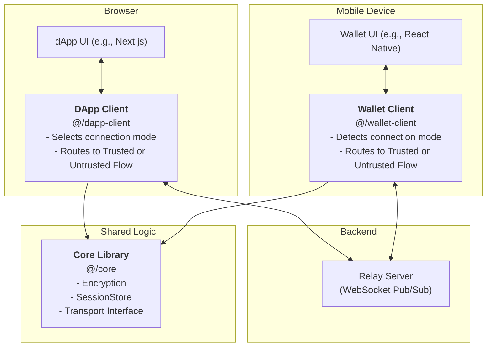

# Mobile Wallet Protocol Architecture

This document provides a high-level overview of the system's components and how they interact. It is intended to give developers a foundational understanding of the architecture before diving into the connection flow or the code.

## Core Components

The protocol is composed of four main components that work together to establish a secure communication channel.

### 1. DApp Client (`@metamask/mobile-wallet-protocol-dapp-client`)

-   **Location:** Lives inside the web-based or react-native decentralized application (dApp).
-   **Responsibilities:**
    -   Initiates new connection requests, specifying a desired connection `mode` (`trusted` or `untrusted`).
    -   Generates a `SessionRequest` to be displayed as a QR code or deeplink.
    -   Manages the dApp's side of the cryptographic handshake.
    -   Handles One-Time Password (OTP) verification when in `untrusted` mode.
    -   Encrypts outgoing requests and decrypts incoming responses from the wallet.

### 2. Wallet Client (`@metamask/mobile-wallet-protocol-wallet-client`)

-   **Location:** Lives inside the Metamask mobile wallet application.
-   **Responsibilities:**
    -   Parses a `SessionRequest` and routes logic based on the specified `mode`.
    -   Generates and displays a secret OTP to the user when in `untrusted` mode.
    -   Manages the wallet's side of the cryptographic handshake.
    -   Encrypts outgoing responses and decrypts incoming requests from the dApp.
    -   Presents requests to the user for approval or rejection.

### 3. Relay Server

-   **Location:** A backend service (implemented here with `centrifugo` via Docker).
-   **Responsibilities:**
    -   Acts as a simple, untrusted message broker using a publish/subscribe model.
    -   Passes messages between the DApp Client and the Wallet Client over WebSocket channels.
    -   Crucially, it has no access to the private keys and cannot read the encrypted message contents. It only sees opaque, encrypted payloads.

### 4. Core (`@metamask/mobile-wallet-protocol-core`)

-   **Location:** A shared library used by both the DApp and Wallet clients.
-   **Responsibilities:**
    -   Provides the foundational logic and interfaces for the entire system.
    -   **Session Management:** Defines the structure for sessions, `SessionRequest`, and connection modes.
    -   **Cryptography:** Includes a `KeyManager` for handling ECIES key generation, encryption, and decryption.
    -   **Transport Abstraction:** Defines the `ITransport` interface, ensuring clients are agnostic to the underlying communication mechanism.

## High-Level Diagram

The following diagram illustrates how these components fit together, highlighting the new routing logic for connection modes.

