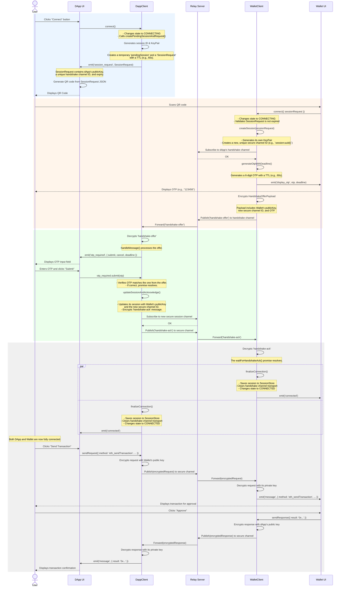

# Connection Flow

This document details the step-by-step process of establishing a secure, end-to-end encrypted session between a dApp and a mobile wallet.

## Connection Flow Diagram

The following sequence diagram illustrates the entire "happy path" of a connection, from the initial user action to the first message exchange.

## Phase Breakdown

The connection process can be broken down into four distinct phases:

### Phase 1: Session Initiation (DApp)
1.  **Trigger:** The user clicks "Connect" in the dApp.
2.  **Action:** The `DappClient` generates a new session ID and a cryptographic key pair. It creates a `SessionRequest` object containing its public key and a temporary, public **handshake channel** ID.
3.  **Result:** The dApp UI receives the `SessionRequest` and renders it as a QR code. This request has a short Time-to-Live (TTL), typically 60 seconds.

### Phase 2: Handshake Offer (Wallet)
1.  **Trigger:** The user scans the QR code with their mobile wallet.
2.  **Action:** The `WalletClient` parses the `SessionRequest`, validates it hasn't expired, and generates its own key pair. It also creates a new, unique, and **secure channel** ID for future communication. The wallet then generates a 6-digit OTP.
3.  **Result:** The wallet UI displays the OTP to the user. The `WalletClient` sends an encrypted `handshake-offer` message to the dApp via the public handshake channel. This offer contains the wallet's public key, the new secure channel ID, and the OTP.

### Phase 3: OTP Verification and Acknowledgement
1.  **Trigger:** The `DappClient` receives the `handshake-offer` message.
2.  **Action:** It decrypts the message and emits an `otp_required` event. The dApp UI prompts the user to enter the OTP they see on their mobile wallet.
3.  **Result:** The user enters the OTP. If it matches the one in the offer, the `DappClient` considers the handshake successful. It sends an encrypted `handshake-ack` message back to the wallet, but this time on the **new secure channel** specified in the offer.

### Phase 4: Connection Finalized
1.  **Trigger:** The `WalletClient` receives the `handshake-ack` message on the secure channel.
2.  **Action:** Both clients now have each other's public keys and have agreed on a secure channel. They save the completed session details to their respective persistent `SessionStore`. This allows the session to be resumed later if the app is closed.
3.  **Result:** Both clients transition to a `CONNECTED` state and emit a `connected` event. The temporary handshake channel is discarded. All future communication is end-to-end encrypted and occurs over the secure channel.
