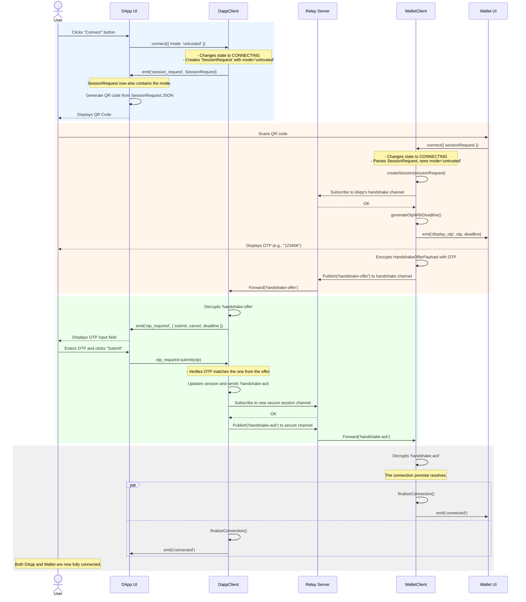
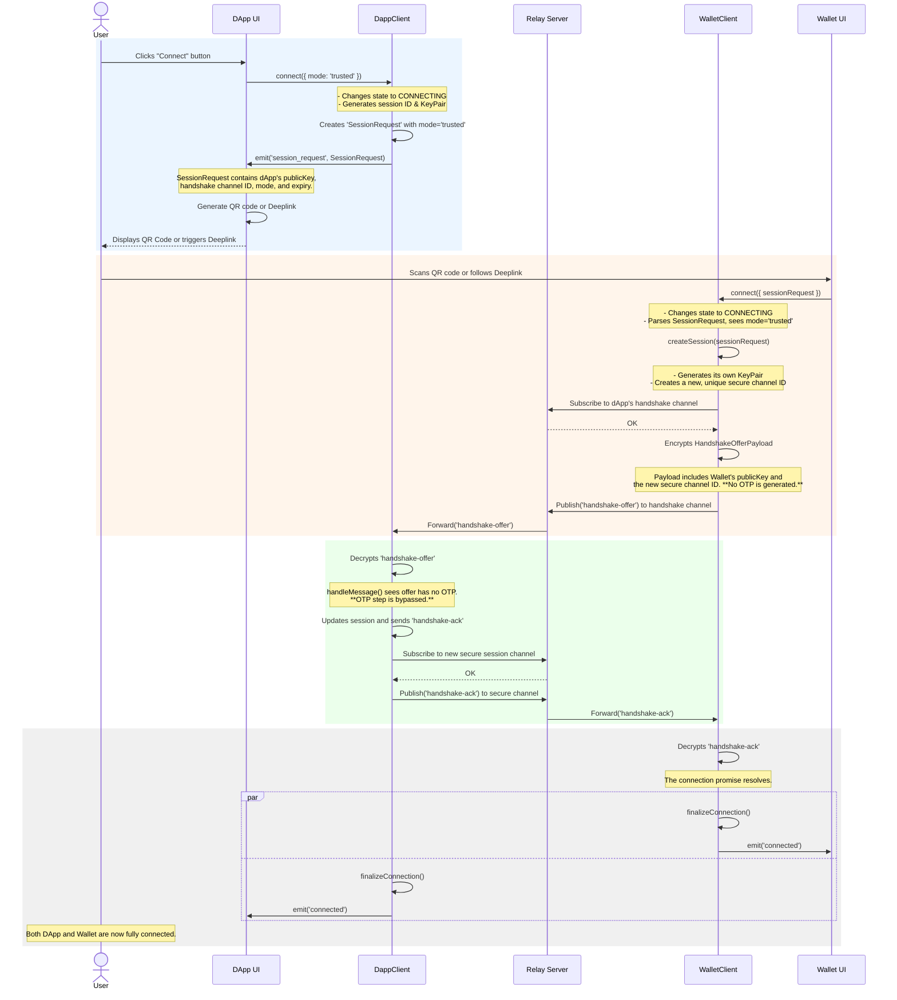

# Connection Flow

This document details the step-by-step process of establishing a secure, end-to-end encrypted session between a dApp and a mobile wallet.

## Connection Modes

The protocol supports two distinct connection flows, chosen by the dApp at the time of connection:

1.  **Untrusted Flow (Default):** The highest security mode, designed for connecting to a dApp in an untrusted browser or environment. It requires the user to verify the connection by entering a One-Time Password (OTP) displayed on their wallet.

2.  **Trusted Flow:** A streamlined, passwordless mode designed for trusted environments, such as when the dApp is running on the same mobile device as the wallet (via deep-linking) or on a user's trusted personal computer. This flow does **not** require an OTP.

---

### Untrusted Flow (OTP)

This is the default and highest security flow for connecting to dApps in untrusted environments.

#### Untrusted Flow Diagram

#### Untrusted Flow Phase Breakdown

1.  **Phase 1: Session Initiation (DApp)**
    *   **Trigger:** The user clicks "Connect" in the dApp.
    *   **Action:** The `DappClient` is called with `connect({ mode: 'untrusted' })` or just `connect()` (untrusted is the default). It creates a `SessionRequest` containing its public key, a handshake channel ID, and `mode: 'untrusted'`.
    *   **Result:** The dApp UI renders the `SessionRequest` as a QR code.

2.  **Phase 2: Handshake Offer (Wallet)**
    *   **Trigger:** The user scans the QR code with their mobile wallet.
    *   **Action:** The `WalletClient` parses the `SessionRequest`, sees `mode: 'untrusted'`, and generates its own key pair, a new secure channel ID, and a 6-digit OTP.
    *   **Result:** The wallet UI displays the OTP. The `WalletClient` sends an encrypted `handshake-offer` to the dApp. This offer contains the wallet's public key, the new secure channel ID, and the OTP.

3.  **Phase 3: OTP Verification and Acknowledgement**
    *   **Trigger:** The `DappClient` receives the `handshake-offer`.
    *   **Action:** It decrypts the message and emits an `otp_required` event. The dApp UI prompts the user to enter the OTP they see on their mobile wallet.
    *   **Result:** If the user enters the correct OTP, the `DappClient` sends an encrypted `handshake-ack` message back to the wallet on the new secure channel.

4.  **Phase 4: Connection Finalized**
    *   **Trigger:** The `WalletClient` receives the `handshake-ack`.
    *   **Action:** Both clients save the completed session details to their `SessionStore`.
    *   **Result:** Both clients transition to a `CONNECTED` state. The temporary handshake channel is discarded, and all future communication is end-to-end encrypted over the secure channel.

---

### Trusted Flow (Passwordless)

This is the streamlined flow for trusted environments, providing the best user experience when security requirements allow.

#### Trusted Flow Diagram

#### Trusted Flow Phase Breakdown

1.  **Phase 1: Session Initiation (DApp)**
    *   **Trigger:** The user clicks "Connect" in the dApp.
    *   **Action:** The `DappClient` is called with `connect({ mode: 'trusted' })`. It generates a `SessionRequest` object containing its public key, a temporary handshake channel ID, and `mode: 'trusted'`.
    *   **Result:** The dApp UI renders the `SessionRequest` as a QR code or uses it to construct a deep link.

2.  **Phase 2: Handshake (Wallet)**
    *   **Trigger:** The user scans the QR code or follows the deep link.
    *   **Action:** The `WalletClient` parses the `SessionRequest` and detects `mode: 'trusted'`. It generates its own key pair and a new secure channel ID. **It does not generate or display an OTP.** It immediately sends an encrypted `handshake-offer` to the dApp containing its public key and the new secure channel ID.
    *   **Result:** The dApp receives the offer. The user is not prompted for any input.

3.  **Phase 3: Finalization**
    *   **Trigger:** The `DappClient` receives the `handshake-offer`.
    *   **Action:** Because the flow is `trusted`, the `DappClient` bypasses the OTP verification step. It immediately sends an encrypted `handshake-ack` message back to the wallet on the new secure channel.
    *   **Result:** The `WalletClient` receives the `handshake-ack`. Both clients save the completed session, discard the temporary handshake channel, and transition to the `CONNECTED` state.