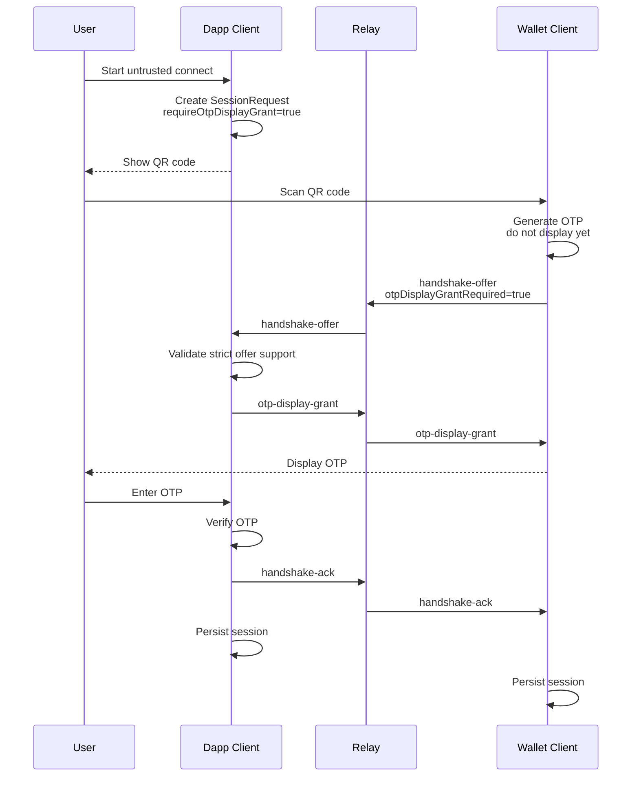

# OTP Display Grant Plan

## Problem

In the current untrusted connection flow, the wallet generates and displays the OTP before the dapp has accepted any specific handshake offer.

A same-room attacker can scan the dapp QR code, front-run their own `handshake-offer`, and, if they learn or control the OTP the user enters, cause the dapp to establish a session with the attacker's public key and channel.

The risk is not front-running alone. Front-running becomes a session hijack when the attacker can also cause the user to enter the OTP that matches the attacker-controlled offer. In a same-room scenario, exposing the OTP too early makes that realistic.

## Goal

Add an optional strict untrusted flow where the wallet client does not display the OTP until the dapp client explicitly grants OTP display for the accepted handshake offer.

This turns attacker front-running into timeout or denial of service:

1. Attacker sends the first offer.
2. Dapp accepts the attacker offer and sends `otp-display-grant` to the attacker's offered session channel.
3. Real MetaMask Mobile never receives the grant.
4. Real MetaMask Mobile never displays the OTP.
5. User has no legitimate OTP to enter.
6. Connection fails instead of binding to the attacker.

## Compatibility Model

Add this as an opt-in strict mode.

```ts
await dappClient.connect({
	mode: "untrusted",
	requireOtpDisplayGrant: true,
});
```

The default remains unchanged.

```ts
await dappClient.connect({ mode: "untrusted" });
```

Compatibility matrix:

| Pair | Result |
| --- | --- |
| Old dapp + old wallet | Current flow works |
| Old dapp + new wallet | Current flow works |
| New dapp without `requireOtpDisplayGrant` + old wallet | Current flow works |
| New dapp with `requireOtpDisplayGrant: true` + old wallet | Fails cleanly |
| New dapp with `requireOtpDisplayGrant: true` + new wallet | New safer flow |

Strict mode must not silently fall back. Otherwise an attacker can downgrade the flow by omitting the new flag in their own offer.

## Protocol Additions

Extend `SessionRequest`:

```ts
type SessionRequest = {
	// existing fields...
	capabilities?: {
		otpDisplayGrant?: true;
	};
};
```

Extend `HandshakeOfferPayload`:

```ts
type HandshakeOfferPayload = {
	// existing fields...
	otpDisplayGrantRequired?: true;
};
```

Add a protocol message:

```ts
type OtpDisplayGrant = {
	type: "otp-display-grant";
};
```

Do not reuse `handshake-ack`. `handshake-ack` should continue to mean "OTP verified; finalize connection."

## New Strict Flow

1. Dapp creates `SessionRequest` with `capabilities.otpDisplayGrant = true`.
2. Wallet scans the request.
3. Wallet generates OTP and deadline but does not emit `display_otp`.
4. Wallet sends `handshake-offer` with `otpDisplayGrantRequired: true`.
5. Dapp receives the offer.
6. If `requireOtpDisplayGrant` is true and the offer lacks `otpDisplayGrantRequired`, dapp rejects.
7. Dapp creates a provisional in-memory session from the offer public key and channel.
8. Dapp subscribes to the proposed session channel.
9. Dapp sends encrypted `otp-display-grant` to the wallet's proposed session channel.
10. Wallet receives the grant and only then emits `display_otp`.
11. User enters OTP into the dapp.
12. Dapp verifies OTP.
13. Dapp sends final `handshake-ack`.
14. Both clients persist and finalize the session.



## Security Note

This does not prove wallet identity cryptographically. It prevents the practical same-room OTP-copy hijack by ensuring OTP is only displayed by the wallet whose offer the dapp accepted.

A front-running attacker can still cause denial of service, but should not be able to make official MetaMask Mobile reveal an OTP for a session the dapp did not accept.
